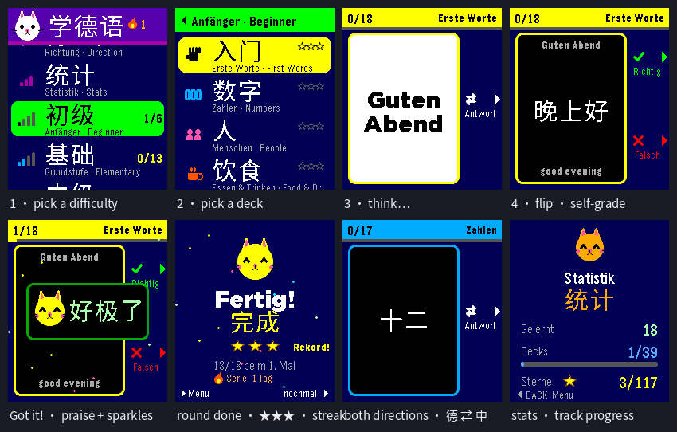

# 🐱 Lern Deutsch · 学德语

一个 **Pebble Time 2** 手表上的**德语 ⇄ 中文单词卡** app，专为中文母语的学习者设计。
翻卡片、看答案、自己打分，小猫为你加油。

Eine **Deutsch ⇄ Chinesisch**-Lernkarten-App für die **Pebble Time 2**, gemacht
für Lernende mit chinesischer Muttersprache. Karte umdrehen, Antwort anschauen,
selbst bewerten — und eine kleine Katze feuert dich an.

> [!IMPORTANT]
> LLM 声明：本项目是在大语言模型（AI 编程工具）的协助下开发的。
> LLM-Hinweis: Dieses Projekt wurde mit Unterstützung von
> Sprachmodellen (KI-Coding-Tools) entwickelt.

## 怎么玩 · So geht's

1. 先选**难度**，再选一组**单词**。
   Wähle zuerst eine **Stufe**, dann ein **Set**.
2. 看正面的词，想一想，按 **SELECT** 翻面看答案。
   Lies das Wort, überlege kurz, drücke **SELECT** — die Karte dreht sich um.
3. 自己打分：**UP = ✓ 会了**，**DOWN = ✗ 还不会**。
   Bewerte dich selbst: **UP = ✓ gewusst**, **DOWN = ✗ noch nicht**.
4. 没记住的卡片还会再来，全部记住这一轮才结束。
   Nicht gewusste Karten kommen wieder, bis du alle kannst — dann ist die Runde fertig.
5. **第一次**就答对的越多，星星越多（最多 ⭐⭐⭐）。每组单词都记住你的最好成绩，
   打破自己的纪录还会看到 **«Rekord!»**。
   Sterne gibt es für Karten, die du beim **ersten Versuch** kannst — bis zu ⭐⭐⭐.
   Jedes Set speichert deine beste Wertung, und wer sie schlägt, sieht ein **«Rekord!»**.
6. 每天至少学完一轮，主页右上角的小火焰 🔥 就会数你连续学习的天数。
   Lerne jeden Tag mindestens eine Runde — die kleine Flamme 🔥 oben rechts
   zählt deine Tage-Serie.

* 方向随时可换：**德语 → 中文** 或 **中文 → 德语**。
  Die Lernrichtung kannst du jederzeit wechseln: **Deutsch → Chinesisch** oder
  **Chinesisch → Deutsch**.
* **Stats** 页统计你学过的单词、完成的组和星星总数。
  Die **Stats**-Seite zählt alle gelernten Wörter, fertigen Sets und Sterne zusammen.

### 按键 · Die Tasten

| 在哪里 · Wo | 按键 · Taste | 做什么 · Funktion |
|------|--------|------|
| 菜单 · Menü | UP / DOWN | 上下移动 bewegen · **SELECT** 打开 öffnen · **BACK** 返回 zurück |
| 卡片正面 · Vorderseite | SELECT | 翻面看答案 Karte umdrehen |
| 卡片 · Karte | 甩一下手腕 · Handgelenk schwenken | 也能翻卡片 dreht die Karte ebenfalls um |
| 卡片背面 · Rückseite | UP / DOWN | ✓ 会了 gewusst / ✗ 没会 nicht gewusst · **SELECT** 再看正面 nochmals die Vorderseite |
| 一轮结束 · Runde fertig | SELECT | 再来一次 nochmal spielen · **BACK** 回菜单 zurück zum Menü |

## 小提示 · Gut zu wissen

德语名词要连冠词一起记。app 里冠词有颜色，帮你记住词性：
Deutsche Nomen lernt man am besten zusammen mit dem Artikel. Die App zeigt
jeden Artikel in einer Farbe — als Gedächtnishilfe:

* **der**（阳性）= 蓝色 blau · **die**（阴性）= 粉色 rosa · **das**（中性）= 绿色 grün

拼写用瑞士写法：永远写 *ss*，不写 *ß*。
Die Schreibweise ist schweizerisch: immer *ss*, nie *ß*.

卡片背面还有一行小小的英语提示。
Auf der Rückseite steht zusätzlich ein kleiner englischer Hinweis.

## 词库 · Der Wortschatz

**4 个难度 · 39 组 · 599 个词** — 4 Stufen · 39 Sets · 599 Wörter

| 难度 · Stufe | 词组 · Sets |
|------|-------|
| **Anfänger** 初级 | Erste Worte 入门 · Zahlen 数字 · Menschen 人 · Essen & Trinken 饮食 · Alltag 日常 · Sätze 句子 |
| **Grundstufe** 基础 | Farben 颜色 · Körper 身体 · Tiere 动物 · Kleidung 衣服 · Zuhause 家 · Zeit & Tag 时间 · Jahreszeiten 季节 · Hobbys & Sport 爱好 · Datum & Monate 日期 · Länder & Sprachen 国家 · Spielplatz 游乐场 · Haustiere 宠物 · Zimmer & Möbel 房间 |
| **Mittelstufe** 中级 | Wetter 天气 · Stadt & Reisen 旅行 · Gefühle 感觉 · Arbeit & Schule 工作 · Verben 2 动词 · Einkaufen & Geld 购物 · Technik 科技 · In der Küche 厨房 · Verkehr & Weg 交通 · In der Stadt 城市 · Bewegung 动作 · Aussehen 外貌 · Dinge im Haus 物品 |
| **Fortgeschritten** 高级 | Im Restaurant 餐厅 · Beim Arzt 看医生 · Sätze 2 会话 · Redewendungen 常用语 · Im Büro 办公 · Meinung 看法 · Notfall 紧急 |

## 安装 · Installation

1. 在手机上装官方 **Pebble app**（[repebble.com/app](https://repebble.com/app) ·
   [Google Play](https://play.google.com/store/apps/details?id=coredevices.coreapp) ·
   App Store），先和手表配对。
   Installiere die offizielle **Pebble-App** auf dem Handy und verbinde zuerst die Uhr.
2. 下载 `.pbw` 文件：本仓库的 **Actions → Build Pebble app → `LernDeutsch-pbw`**。
   Lade die `.pbw`-Datei herunter: in diesem Repo unter
   **Actions → Build Pebble app → `LernDeutsch-pbw`**.
3. 把 `.pbw` 传到手机，用文件管理器打开 —— 它会在 Pebble app 里打开，点 **Install** 就装到手表上了。
   Schicke die Datei aufs Handy und öffne sie mit dem Datei-Manager — sie
   öffnet sich in der Pebble-App. Dann **Install** antippen.

Android 上如果没有"用 Pebble 打开"的选项，可以用 [Rebble 的 Sideload Helper](https://help.rebble.io/sideloading/)。
Falls Android keine Option «mit Pebble öffnen» zeigt, hilft der
[Sideload Helper von Rebble](https://help.rebble.io/sideloading/).

App 支持的手表是 **Pebble Time 2**（`emery`）。
Die App läuft auf der **Pebble Time 2** (`emery`).

---

想自己编译、加单词、或了解技术细节（比如怎么在 Pebble 上画汉字）？请看 [AGENTS.md](AGENTS.md)。
Selber bauen, eigene Wörter hinzufügen oder die Technik verstehen (z. B. wie
man chinesische Zeichen auf eine Pebble zeichnet)? Siehe [AGENTS.md](AGENTS.md).

中文字形来自 **Noto Sans SC** © The Noto Project Authors，[SIL OFL 1.1](https://openfontlicense.org/) 授权。
Die chinesischen Schriftzeichen stammen aus **Noto Sans SC** © The Noto Project
Authors, Lizenz [SIL OFL 1.1](https://openfontlicense.org/).

祝你学习顺利！加油！Viel Erfolg beim Deutschlernen! 💛
